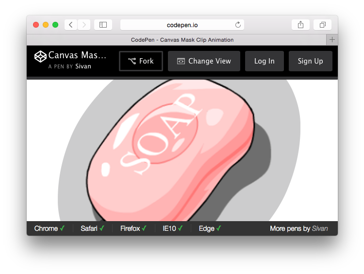

# Codebar.js

A [codebar](//sivan.github.io/codebar.js/) for codepens.



## Usage

1. Add `codebar.js` at **Add External JavaScript** section in **[Pen Settings - JavaScript]**  
    (Example url: `//sivan.github.io/codebar.js/dist/codebar.js`)
2. Add pen config at **Stuff for &lt;head&gt;** section in **[Pen Settings - HTML]** 

Here is a config sample:

```html
<script>
var codebarConfig = {
  browsers: {
    chrome: '43+',
    ff: false,
    safari: null,
    ie: 8
  },
  players: {
    developer: {
        name: "Sivan",
        url: "http://codepen.io/sivan/"
    }
  }
};
</script>
```

Tips: 

* Set browser value to `false` if this pen doesn't support this browser;
* Set browser value to `null` if you want to hide this browser.

## Default Config

```json
{
  "browsers": {
    "chrome": true,
    "safari": true,
    "ff": true,
    "ie": true,
    "edge": true
  },
  "players": {
    "developer": {
      "name": "Sivan",
      "url": "http://codepen.io/sivan/"
    },
    "designer": false
  },
  "ui": {
    "theme": "dark"
  }
}
```

-- EOF --
