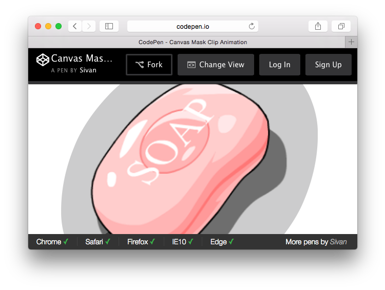

# Codebar.js

A codebar for [codepen](http://codepen.io/).



## Usage

1. Add `codebar.js` at **Add External JavaScript** section in **[Pen Settings - JavaScript]** 
2. Add pen config at **Stuff for &lt;head&gt;** section in **[Pen Settings - HTML]** 

Here is a config sample:

```html
<script>
var codebarConfig = {
  browsers: {
    chrome: '43+',
    ff: false,
    ie: 8
  },
  players: {
    host: {
        name: "Sivan",
        url: "http://codepen.io/sivan/"
    }
  }
};
</script>
```

Tips: 

* All browser support are setting to `true` in default;
* Set to `false` if this pen doesn't support this browser;
* Set to `null` if you want to hide this browser

-- EOF --
